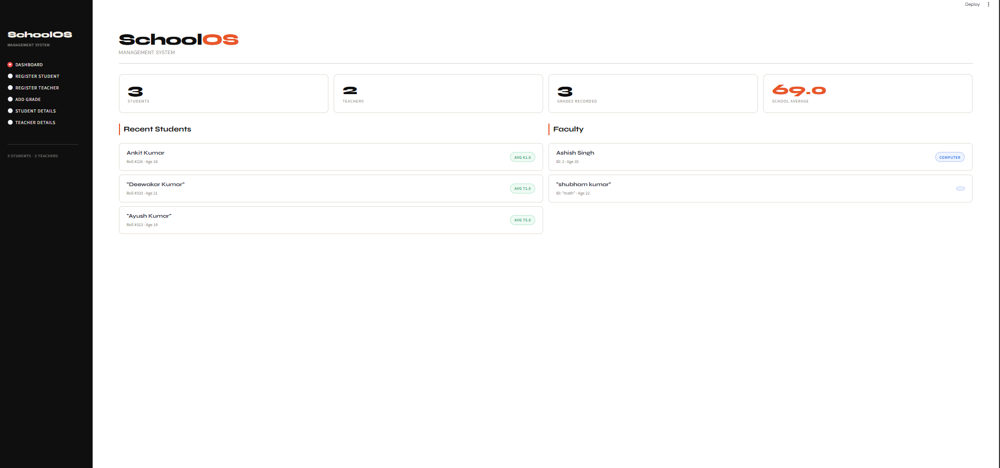

# 🏫 SchoolOS – School Management System

> Manage students, teachers, and grades through a simple and interactive school management system.

SchoolOS is a **School Management System** built using **Python, Streamlit, JSON, and Object-Oriented Programming (OOP)**. The application provides an interactive dashboard for managing students, teachers, and student grades.

The project also includes a **console-based implementation** demonstrating important OOP concepts such as **Abstraction, Inheritance, Abstract Classes, and Static Methods**.

---

## ✨ Features

### 👨‍🎓 Student Management

- 📝 Register new students
- 👤 Store student name, age, email, and roll number
- 🚫 Prevent duplicate roll numbers
- 📧 Validate email addresses
- 🔍 View complete student details
- 📊 View student grades and average score

### 👨‍🏫 Teacher Management

- 📝 Register new teachers
- 👤 Store teacher name, age, email, subject, and employee ID
- 🚫 Prevent duplicate employee IDs
- 📧 Validate email addresses
- 🔍 View teacher details

### 📚 Grade Management

- 👨‍🎓 Select a registered student
- ➕ Add grades for different subjects
- 💯 Store marks between 0 and 100
- 📊 Automatically calculate student average
- 📋 Display subject-wise grades

### 📊 Dashboard

The dashboard provides:

- 👨‍🎓 Total number of students
- 👨‍🏫 Total number of teachers
- 📝 Total grades recorded
- 📈 School average
- 👥 Recent students
- 🧑‍🏫 Faculty information

### 💾 Data Persistence

All student, teacher, and grade records are stored in:

```text
school_data.json

The application loads existing data when it starts and saves changes back to the JSON file.

📌 Overview

SchoolOS provides a simple interface for managing basic school records.

The application combines a Streamlit web interface with a JSON-based local data storage system.

                 🏫 SchoolOS
                      ↓
              📊 Dashboard
                      ↓
        ┌─────────────┼─────────────┐
        ↓             ↓             ↓
   👨‍🎓 Students   👨‍🏫 Teachers   📚 Grades
        ↓             ↓             ↓
        └─────────────┼─────────────┘
                      ↓
             💾 school_data.json
🔄 Application Workflow
Start Application
       ↓
Load school_data.json
       ↓
Open SchoolOS Dashboard
       ↓
Select an Operation
       ↓
Register Student / Teacher
       ↓
Add Student Grades
       ↓
View Student / Teacher Details
       ↓
Calculate Statistics
       ↓
Save Data to JSON
🌐 Streamlit Application

The main web application is developed using Streamlit.

The application provides the following navigation options:

🏠 Dashboard
👨‍🎓 Register Student
👨‍🏫 Register Teacher
📚 Add Grade
🔍 Student Details
🔍 Teacher Details

The interface uses custom CSS to provide a clean and modern management-dashboard design.

📊 Dashboard

The dashboard provides an overview of the complete school data.

It displays:

👨‍🎓 Total Students
👨‍🏫 Total Teachers
📝 Total Grades Recorded
📈 School Average
👥 Recent Students
🧑‍🏫 Faculty Information

The school average is calculated from the recorded student grades.

👨‍🎓 Student Registration

The student registration section collects:

👤 Full Name
📧 Email Address
🎂 Age
🔢 Roll Number

The application validates the entered information and prevents duplicate roll numbers before registering a student.

👨‍🏫 Teacher Registration

The teacher registration section collects:

👤 Full Name
📧 Email Address
📚 Subject
🎂 Age
🆔 Employee ID

The application validates the email address and prevents duplicate employee IDs.

📚 Grade Management

The Add Grade section allows users to add marks for registered students.

The user provides:

👨‍🎓 Student
📖 Subject
💯 Marks

Marks are accepted between 0 and 100.

The system stores the grades and automatically calculates the student's average score.

🔍 Student Details

The Student Details section allows users to select a registered student and view:

👤 Full Name
🔢 Roll Number
🎂 Age
📧 Email
📊 Average Score
📚 Subject-wise Grades

The average score is automatically calculated using the student's recorded grades.

🔍 Teacher Details

The Teacher Details section displays:

👤 Full Name
🆔 Employee ID
🎂 Age
📚 Subject
📧 Email

for the selected teacher.

🧩 Object-Oriented Programming

The console implementation demonstrates important OOP concepts.

1. Abstract Class

Persons is an abstract base class containing common methods for students and teachers.

class Persons(ABC):

It defines methods such as:

get_roles()
register()
show_details()
2. Inheritance

Student and Teacher inherit from the Persons class.

class Student(Persons):
class Teacher(Persons):
3. Abstraction

Common operations are defined in the parent class while student- and teacher-specific implementations are provided in their respective classes.

4. Static Method

Email validation is implemented using a static method:

@staticmethod
def validate_email(email):
5. Structured Data

Student and teacher information is maintained using structured dictionaries and stored in the JSON database.

💻 Console Version

main.py provides a command-line version of the SchoolOS system.

The console menu supports:

1️⃣ Register a student
2️⃣ Register a teacher
3️⃣ Add grades
4️⃣ Show student details
5️⃣ Show teacher details

The console version demonstrates the implementation of OOP concepts along with JSON-based data storage.

💾 Data Storage

SchoolOS uses JSON as a lightweight local database.

school_data.json

The file stores:

👨‍🎓 Student information
👨‍🏫 Teacher information
📚 Student grades

Example structure:

{
    "students": [
        {
            "name": "Student Name",
            "age": 19,
            "email": "student@example.com",
            "roll_no": "101",
            "grades": {
                "Math": 75
            }
        }
    ],
    "teachers": [
        {
            "name": "Teacher Name",
            "age": 35,
            "email": "teacher@example.com",
            "subject": "Computer",
            "emp_id": "1"
        }
    ]
}
🛠️ Tech Stack
Technology	Purpose
🐍 Python	Core programming language
🌐 Streamlit	Interactive web application
🗃️ JSON	Local data storage
🧩 OOP	Application structure and programming concepts
🎨 HTML/CSS	Custom user interface styling
📁 Project Structure
SchoolOS/
│
├── app.py
├── main.py
├── school_data.json
├── demo.png
└── README.md
📄 File Description
File	Purpose
app.py	Main Streamlit web application
main.py	Console-based OOP implementation
school_data.json	Local JSON database
demo.png	Application screenshot
README.md	Project documentation
📸 Application Preview
<p align="center">  </p>

The application provides a clean dashboard for managing students, teachers, and grades.

🚀 Installation & Setup
Prerequisites

Make sure you have:

🐍 Python 3.x
📦 pip
🐙 Git
1. Clone the Repository
git clone https://github.com/your-username/SchoolOS.git
2. Navigate to the Project
cd SchoolOS
3. Install Dependencies

Install Streamlit:

pip install streamlit
▶️ Run the Web Application

Start the Streamlit application:

python -m streamlit run app.py

Streamlit will provide a local URL in the terminal.

Usually:

http://localhost:8501

Open the URL in your browser.

💻 Run the Console Application

To run the console-based OOP implementation:

python main.py

Then select an option from the displayed menu.

🎯 How to Use
👨‍🎓 Register a Student
Open Register Student
Enter the student's name
Enter email address
Enter age
Enter roll number
Click the registration button
👨‍🏫 Register a Teacher
Open Register Teacher
Enter teacher information
Enter subject
Enter employee ID
Submit the form
📚 Add a Grade
Open Add Grade
Select a student
Enter the subject
Enter marks
Save the grade
🔍 View Details

Use:

Student Details
Teacher Details

to view stored information.

✅ Validation

The project includes basic input validation:

⚠️ Required fields cannot be empty
📧 Email must contain @ and .
🔢 Student roll numbers must be unique
🆔 Teacher employee IDs must be unique
🎂 Student age is limited to 5–30 in the web interface
🎂 Teacher age is limited to 21–70 in the web interface
💯 Marks are limited to 0–100
🎨 User Interface

The Streamlit application uses custom CSS to provide:

🌑 Dark sidebar
✨ Clean typography
📊 Statistics cards
👨‍🎓 Student cards
👨‍🏫 Teacher cards
📝 Form styling
🏷️ Grade indicators
✅ Success and error messages
📱 Responsive layout
📚 Core Concepts

This project demonstrates practical implementation of:

🐍 Python Programming
🌐 Streamlit
🧩 Object-Oriented Programming
📦 Abstract Classes
🔗 Inheritance
⚙️ Static Methods
🗃️ JSON File Handling
🔄 CRUD-style Data Management
✅ Form Validation
💾 Data Persistence
🎨 UI Design
🔮 Future Improvements

Possible improvements for future versions:

🔐 Admin login and authentication
📅 Student attendance management
🔎 Search and filter functionality
✏️ Edit and delete records
🏫 Class and section management
📊 Attendance reports
📄 PDF report generation
🗄️ Database integration
👥 Role-based access control
🕐 Teacher timetable management
📈 Student performance charts
☁️ Cloud deployment
💾 Backup and restore functionality
🎓 Learning Outcomes

Through this project, I practiced:

🐍 Python programming
🌐 Streamlit application development
🗃️ JSON file handling
🧩 Object-Oriented Programming
📦 Abstract classes
🔗 Inheritance
⚙️ Static methods
✅ Form validation
🎨 Dynamic UI development
💾 Data persistence
🔗 Git and GitHub
📌 Project Status

🟢 Status: Completed / Functional

The current version provides:

👨‍🎓 Student registration
👨‍🏫 Teacher registration
📚 Grade management
📊 Dashboard statistics
🔍 Student details
🔍 Teacher details
💾 JSON-based data persistence
👨‍💻 Author

Ayush Kumar

🎓 B.Tech — Computer Science & Engineering (AI & ML)

🐙 GitHub: @ayush-kumar06
💼 LinkedIn: Ayush Kumar
🙏 Acknowledgements
🌐 Streamlit — Web application framework
🐍 Python — Core programming language
🗃️ JSON — Local data storage
🧩 Object-Oriented Programming — Application architecture
⭐ Support

If you found this project useful, consider giving the repository a ⭐.

<p align="center"> Built with 🐍 Python • 🌐 Streamlit • 🧩 OOP • 💾 JSON </p>
